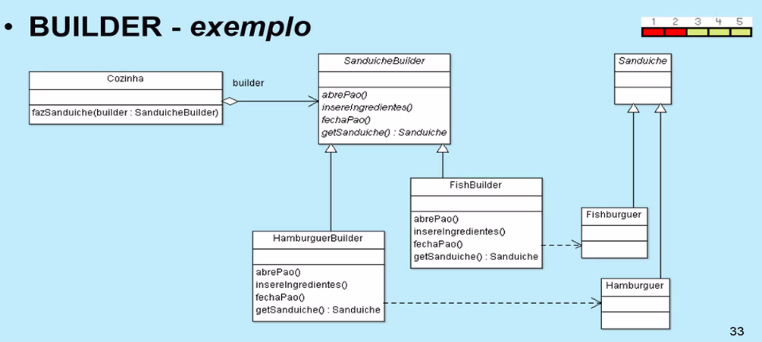

-----------------------------------------------
<h1>Seção 01 - Introdução</h1>

<h2>Introdução à UML</h2>

* GoF(Gang of Four)
	* Erich Gamma
	* Richard Helm
	* Ralph Johnson
	* John Vlissides

* 23 Padrões de Projeto

* UML - Unified Modeling Language
* Linguagem Unificada de Modelagem
* Especificação, documentação.
	* Não é uma métodologia de desenvolvimento
	* Oferece conjunto de ferramentas para a modelagem de ferramentas. Ex: Diagrama de Classes

* GoF
	* Diagrama de Classe
	* Diagrama de Sequencia
	* Os dois diagramas utilizados para demonstrar os padrões GoF

<h2>Diagrama de Classes</h2>

* Mostra um conjunto de classes, interfaces e colaborações e seus relacionamneto, Os diagramas de classes abrangem a visão estática do projeto de um sistema; um diagrama que mostra a coleção de elementos declarativos (estáticos).

* Atributos -> Fields - Características e estados do Objeto.
* Métodos -> Representam as operações e comportamentos do objeto.

<h2>Associação entre Classes</h2> 

* Um relacionamento estrutural que descreve um conjunto de vínculos, em que o vínculo é uma conexão entre Objetos.
* Associações podem ser:
	* Unárias ou Reflexiva -> Classe relacionada com ela mesma
	* Binárias -> Classe se relaciona com outra classe
	* Múltiplas -> Classe se relaciona a duas ou mais classes

* Cardinalidade ou Multiplicidade
	* Determina quantos objetos no sistema são possíveis em cada vértice da associação.

* Navegação
	* Se é possível para cada objeto acessar outro objeto da mesma associação.
	* Bidirecional
	* Unilateral

<h2>Herança entre Classes</h2>

* É um relacionamento do tipo generalização/ especialização, onde uma classe pode ser derivada (subclasse) de outra mais geral (superclasse), absorvendo todas as características fundamentais e adicionando outras novas características, de tal modo a torná-las mais especilazada.

* Identificando especializações:
	* Pessoa Física é um Cliente
	* Pessoa Jurídica é um Cliente

<h2>Relacionamento de Agregação e Composição</h2>

* Agregação
	* Tipo de relacionamento com características todo-parte.
	* Certo grau de independência entre as classes.

* Composição
	* Tipo de relacionamento com característica todo-parte
	* Alto grau de coesão entre o todo e as partes.

<h2>Dependência entre Classes</h2>

* Relacionamento entre duas classes: cliente (client) e fornecedor (supplier).
* Classe cliente usa/depende da classe fornecedor.
* A alteração da classe independente poderá afetar a semântica da classe dependente.

----------------------------------------------------------------
<h1>Seção 02 - Introdução aos padrões GOF</h1>

* Composto por 23 padrões
* Tipos dos padrões do projeto:
	* Criação
	* Estruturais
	* Comportamentais

* Descrevem soluções para problemas recorrentes no desenvolvimento de sistemas orientado a objetos.
	* Possui um nome
	* Define o problema
	* Define a solução
	* Quando aplicar esta solução
	* Consequências

* Padrões de Criação (Criacionais) - Possui 5 Padrões GoF
	* Aplicam-se em situações que envolvem a criação de objetos.
	* Ajudam a fazer um sistema independente de como seus objetos são criados, compostos e representados.

* Os padrões não foram feitos para aprender na primeira vez que faça. Fazendo várias vezes será compreendido.

* Padrões Estruturais - Possui 7 Padrões GoF
	* De que maneira as classes e objetos são compostos para a formação de grandes estruturas.

* Padrões Comportamentais - 11 Padrões de Projeto GoF
	* Procupam-se com algoritmos e atribuição de responsabilidades entre objetos. Descrevem, também, um padrão de comunicação entre classes ou objetos.

--------------------------------------------------------------------------
<h2>Seção 03 - GoF - Criação</h2>

<h2>Singleton #1</h2>

* Padrões de Criação (Criacionais) - 5
	* Eles disponibilizam uma maneira para criar objetos ocultando os detalhes da sua criação, ao invés de utilizar o operador new diretamente. Isto dá mais flexibilidade na hora de decidir quais objetos precisam ser criados para um determinado caso.

* Intenção: Garantir que uma determinada classe tenha uma, e somente uma instância, mantendo um ponto global de acesso para a mesma.

* Padrão nível 4

<h2>Factory Method #2</h2>

* Intenção: Definir uma interface para criar um objeto, mas deixar as subclasses decidierem que calsse instanciar.
* Cria uma instância de várias classes derivadas.
* Nível de frequência - 5 - Alto
* Boa expansividade

<h2>Abstract Factory #3</h2>

* Intenção: Fornecer uma interface para criação de famílias de objetos relacionados ou dependentes sem especificar suas classes concetras.
* Cria uma instância de várias famílias de classes.
* Nível de frequência - 5 - Alto.

<h2>Builder #4</h2>

* Intenção: Separar a construção de um objeto complexo da sua representação de modo que o mesmo processo de construção possa criar diferentes representações.
* Separa a construção do objeto de sua representação.
* Nível de frequência - 2 - 

<h2>Prototype #5</h2>

* Intenção: Especificar os tipos de objetos a serem criados usando uma instância protótipo e criar novos objetos pela cópia deste protótipo.
* Uma instância inicializada a ser copiada ou clonada.
* Nível de Frequência - 3.
* Muito utilizada em jogos.

--------------------------------------------------------
<h1>Seção 04 - GoF - Estrutural</h1>

* Padrões Estruturais - Possuem 7
	* Eles se preocupam com a composição das classes e seus objetos. O conceito de herança é largamente utilizado para compor interfaces e definir maneiras para compor objetos e objter novas funcionalidades.

<h2>Bridge #6</h2>

* Intenção: Desacoplar uma abstração da sua implementação, de modo que as duas possam varias independentemente.
* Separa a interface do objeto de sua implementação.
* Frequência de uso - 3

<h2>Adapter #7</h2>

* Intenção: Converter a interface de uma classe em outra interface, esperada pelos clientes. O Adapter permite que classes com interfaces incompatíveis trabalhem em conjunto o que, de outra forma, seria impossível.
* Equiparar interfaces de diferentes classes.
* Frequência de uso - 4.

<h2>Proxy #8</h2>

* Intenção: Fornece um substituto (surrogate) ou marcador da localização de outro objeto para controlar o acesso ao mesmo.
* Um objeto representado um outro objeto.
* Frequência de uso - 4
* Chamada de objetos remotos (muito utilizado)
* Representa um objeto distânte do cliente.
* Utilizado para controle de acesso. Encapsula um dado objeto.

<h2>Decorator #9</h2>

* Intenção: Agregar dinamicamente responsabilidades adicionais a um objeto.
* Motivação: Objeto usado possui funcionalidades básicas e precisa adicionar funcionalidades em tempo de execução.

<h2>Composite #10</h2>

* Intenção: Compor objetos em estruturas de árvore para representaram hierarquias todo-parte.
* Frequência de uso - 4.

<h2>Façade (Facade) #11</h2>

* Intenção: Fornecer uma interface unificada para um conjunto de interfaces em um subsistema. Façade define uma interface de nível mais alto que torna o subsistema mais fácil de ser usado.
* Uma única classe representa um subsistema inteiro.
* Frequência de uso - 5. - Muito alta.

<h2>Flyweight #12</h2>

* Intenção: Usar compartilhamento para suportar eficientemente grandes quantidades de objetos de granularidade fina.
* Frequência de uso - 1 - Muito baixa.
* Informações permitidas e recurso de memória é limitado.

* Estado intrínseco/ extrínseco.
	* Intrínseco - Próprio objeto/da classe.
	* Extrínseco - FOra do objeto.

---------------------------------------------------------------------
<h1>Seção 05 - GoF - Comportamental</h1>

<h2>Padrões comportamental - 11 Padrões</h2>

* Eles são especificamente relacionados com a comunicação entre objetos.

<h2>Command #13</h2>

* Intenção: encapsular uma solicitação como um objeto, desta forma permitindo parametrizar clientes com diferente solicitações, enfileirar ou fazer o registro (log) de solicitações e suportar operações que podem ser desfeitas.
* Encapsular comandos como um objeto.
* Frequência de utilização - 4 - Alta.
* Classico disso - Ctrl Z - Undo / Redo

<h2>Strategy #14</h2>

* Intenção: Definir uma família de algoritmos, encapsular cada uma delas e torná-las intercambiáveis. Strategy permite que o algoritmo varie independentemente dos clientes que o utilizam.
* Encapsular algoritmos ("estratégias") como um objeto.
* Frequência de utilização - 4 - Alta.

<h2>State #15</h2>

* Intenção: Permite a um objeto alterar seu comportamento quando o seu estado interno muda. O objeto parecerá ter mudado sua classe.
* Alterar o comportamento de um objeto quando seu estado muda.
* Frequência de utilização - 3 - Média.

<h2>Observer #16</h2>

* Intenção: Definir uma dependência um-para-muitos entre objetos, de maneira que quando um objeto muda de estado todos os seus dependentes são notificados e atualizados automaticamente.
* Frequência de utilização - 5 - Muito alta.

<h2>Mediator #17</h2>

* Intenção: Definir um objeto que encapsula a forma como um conjunto de objetos interage O Mediator promove o acoplamento fraco ao evitar que os objetos se refiram uns aos outros explicitamente e permite variar suas interações independentemente.
* Definir uma comunicação simplificada entre as classes.
* Frequência de utilização: 2 - Baixa.

* Dependência sem o mediator é alta.

<h2>Chain of Responsibility #18</h2>

* Intenção: Evitar o acoplamento do remetente de uma solicitação ao seu receptor, ao dar a mais de um objeto a oportunidade de tratar a solicitação. Encadear os objetos receptores, passando a solicitação ao longo da cadeia até que um objeto a trate.
* Uma maneira de passar uma requisição entre uma cadeia de objetos.
* Frequência de utilização: 2 - Baixa.

