-----------------------------------------------------------------------
<h1>Seção 01 - Introdução</h1>

* Boas práticas. Para evitar trechos de códigos confusos, pois o suporte ao código fica algo difícil.

* Existe regras ou padrões para evitar tudo isso?

* Através dos Design Patterns e suas ligações sobre a crise do software.

* Seguir as regras do SOLID.

-----------------------------------------------------------------------
<h1>Seção 02 - Crise do Softawre</h1>

<h2>Contexto Pré-Crise do Software</h2>

* SOLID - Inicio do desenvolvimento de software 

* Softwares pequenos - Com o tempo começaram a crescer e necessidade de sistemas inteiros.

* Poucos recursos - Com o tempo foram cada vez mais necessitando de mais recursos.

* Mercado iniciando, ainda pequeno - Mercado começou a crescer, junto com a demanda de software.

* Tecnologia 'desconhecida' - Tecnologias novas começaram a aparecer e mais diversificadas.

* Inexistência de UX - A necessidade em agradar o usuário começou a aparecer.

* Diferentes formas de monetização - Mudanças para se encaixar ao mercado.

* Falta de visão de futuro (Novas versões e manutenção) - Com o tempo passou a ser necessário a reestruturar o código.

* Foi então desenvolvida a área de engenharia de software

<h2>Contexto Pós-Crise de Software</h2>

* Engenharia de Software - Criada para melhorar a crise do software.

* Engenharia de software trouxe:
	* Processo de desenvolvimento bem estruturado
	* Divisão de responsabilidades entre a equipe
	* Controle de versões
	* Visão de futuro de produto (software)
	* Documentação
	* Fechamento de escopo
	* Reutilização

* Falta organizar melhorar o código

* Foi pensando nessa necessidade de melhorar e organizar os códigos que começaram a se pensar em padronizar os códigos:
	* Desenvolvendo de um jeito consciente
	* De forma com que a equipe consiga entender o que está fazendo
	* Pensando sempre no projeto como um todo, do início ao fim.
		* Gerando assim os Design Patterns
--------------------------------------------------------
<h1>Seção 03 - Introdução ao SOlid</h1>

<h2>Criação do SOLID</h2>

* No final da década de 90, Robert C. Martin, famoso pelo apelido "Uncle Bob" começou a pensar em problemas que ocorrem no desenvolvimento de softwares e como resolver.

* Seu estudo se popularizou e está completo no livro "Agile Principles, Patterns And Practices in C#", feito por ele.

* Seu projeto ficou conhecido pela sigla formada pela inicial de cada um dos princípios seguidos no padrão: S.O.L.I.D.

<h2>Benefícios do SOLID</h2>

* Os princípios SOLID devem ser aplicados para se obter os benefícios da orientação a objetos, tais como:
	* Seja fácil de se manter, adaptar e se ajustar às alterações de escopo;
	* Seja testável e de fácil entendimento;
	* Seja extensível para alterações com o menor esforço necessário;
	* Que forneça o máximo de reaproveitamento;
	* Que permaneça o máximo de tempo possível em utilização.

* Utilizando os princípios SOLID é possível evitar problemas muito comuns:
	* Dificuldade na testabilidade / criação de testes de unidade;
	* Código sem estrutura ou padrão;
	* Dificuldades de isolar funcionalidades;
	* Duplicação de código, uma alteração precisar ser feita em N pontos;
	* Fragilidade, o código quebra facilmente em vários pontos após alguma mudança.

<h2>Significado de SOLID</h2>

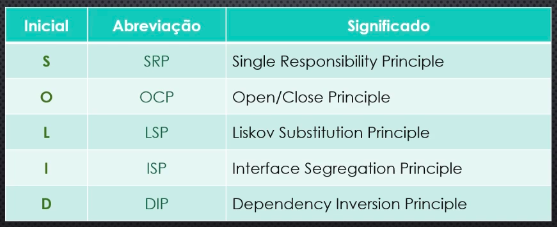
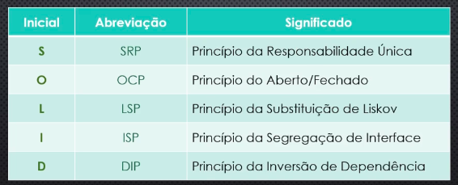
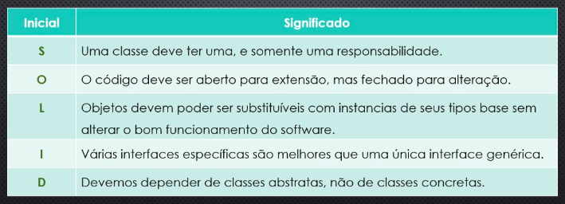

----------------------------------------------------------------
<h1>Seção 04 - Princípio da Responsabilidade Única</h1>

<h2>Teoria</h2>
* SRP

* Primeiro princípio do SOLID, sendo considerado por muitos a base para o restante.
	* Uma classe deve ter uma, e somenta uma responsabilidade.
	* Uma classe nunca pode ter responsabilidade de outra classe.
	* Toda classe deve ter um inicio e fim conhecido.
	* Busca-se a alta coesão de código-classe
	* A responsabilidade deve estar totalmente encapsulada na respectiva classe.
	* Onde se tem muita generalização não é possível ter especialização.

* O SRP tem como base principal o princípio de que cada classe tenha apenas uma responsabilidade.
	* Classe Venda só cuida das vendas;
	* Classe Produto não pode cuidar de vendas.

* Além disso, possui um secundário que é um dos pilares da orientação a objetos, o encapsulamento.
	* Tudo o que não for de uso público obrigatoriamente, deve ser mantido em segredo dentro da classe;
	* Uso de get e set para retorno e atribuição de valores.

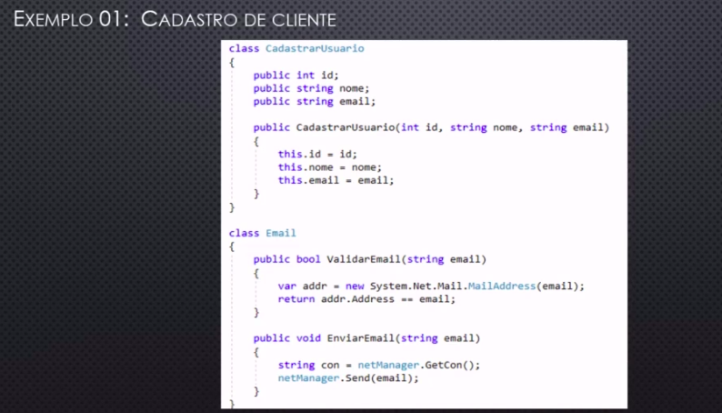

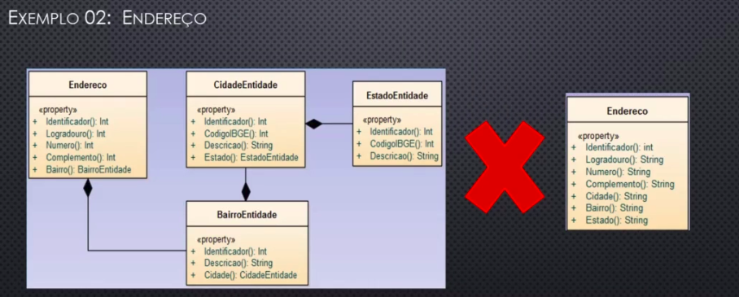

--------------------------------------------------------------------------------------
<h1>Seção 05 - O - Princípio do Aberto/Fechado</h1>

* OCP
* Tem como princípio que o código deve estar aberto para EXTENSÕES, porém, fechado para ALTERAÇÕES:
	* Toda atualização/adição de funcionalidade que modifique um código existente é chamada de alteração.
	* Toda atualização/adição de funcionalidade que NÃO modifique nenhum código existente é chamada de extensão.

* Conseguimos obedecer esse princípio por meio de abstração:
	* Toda interface ou classe abstrata possui apenas uma abstração da função a ser implementada, sendo assim, ela nunca é alterada, apenas extendida.

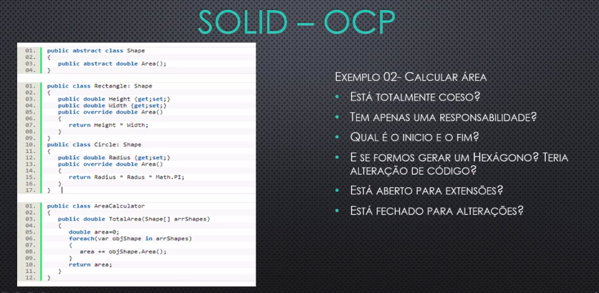

---------------------------------------------------------------
<h1>Seção 06 - L - Princípio da Substituição de Liskov</h1>

* LSP
* Tem como princípio que classes derivadas devem poder ser substituídas por suas classes base.
	* Considerado uma extensão do OCP.
	* Em resumo, diz que toda classe filho deve poder ser substituída pela pai sem problemas, seja o pai uma interface, classe ou classe abstrata.
		* Não devendo ser necessário alterar o pai para isso.
	* Também liga-se as boas práticas de POO onde a classe que herdar de uma abstração (interface ou classe abstrata) deve ter função para tudo o que foi herdado, não tendo heranças desnecessárias.

* Exemplo 01 - No mundo real
	* Considere que numa determinada família o pai seja um médico cirurgião e o filho seja um músico.
		* O pai tem conhecimento em medicina, como foco em cirurgias e o filho conhecimento em música, tendo uma banda de rock.

* Neste exemplo, mesmo que se trata da mesma hierarquia familiar, o filho e o pai não podem um substituir o outro, certo?
	* O pai não pode fazer uma turnê de rock e o filh onão pode operar alguém.
		* Dessa forma, o LSP NÃO está sendo empregado nesta família.

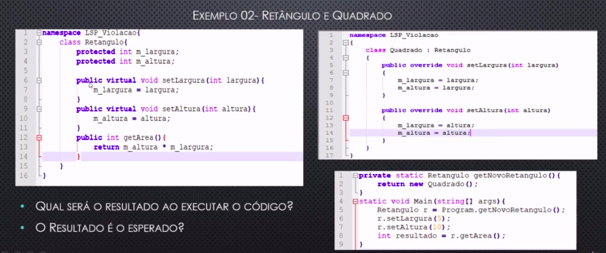

-------------------------------------------------------------------------
<h1>Seção 07 - Princípio da Segregação de Interface</h1>

* ISP
* Tem como princípio que todas as interfaces implementadas não devem ter funções que não são utilizadas pela classe que a implementou.
	* EM outras palavras "Uma classe consumidora não deve conhecer (depender) de métodos que não necessitam".
	* Em resumo, diz que toda classe que herde de uma interface não pode ter métodos que não são usados.
		* Usando a lógica, podemos ver que na maior parte dos casos, caso o ISP não seja respeitado, teremos problemas com o OCP e o LSP também.

-------------------------------------------------------------------------------
<h1>Seção 08 - Princípio da Inversão de Dependência</h1>

* DIP
* Tem como princípio ser uma maneira específica para desacoplar as dependências entre os objetos.
	* Componentes (Classes) de mais alto nível não devem depender de componentes (Classes) de níveis mais baixos, mas ambos devem depender de abstrações.
	* Abstrações não devem depender de detalhes (implementações), mas os detalhes (implementações) devem depender de abstrações.
	* Inverter a dependência faz com que um cliente não fique frágil a mudanças relacionadas a detalhes de implementação.
		* Isto é, alterar o detalhe não quebra o cliente.
		* Além disso, o mesmo cliente pode ser reutilizado com outro detalhe de implementação.

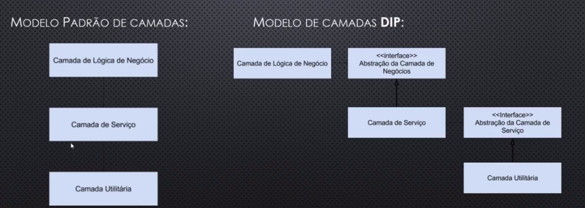
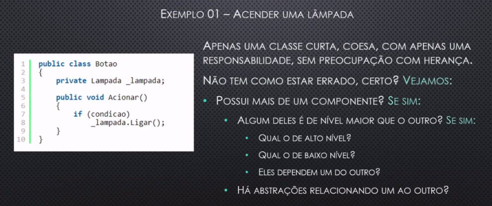
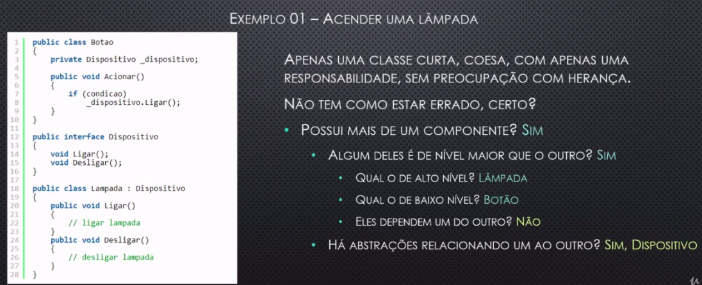

* Um botão não depende mais da lampada, com isso pode ser criado novos dispositivos.

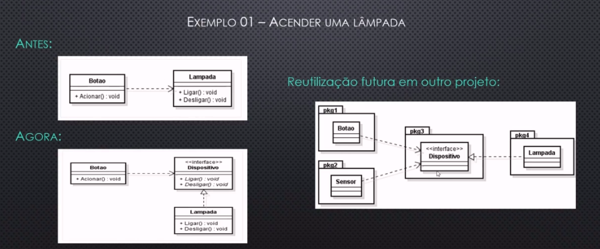

